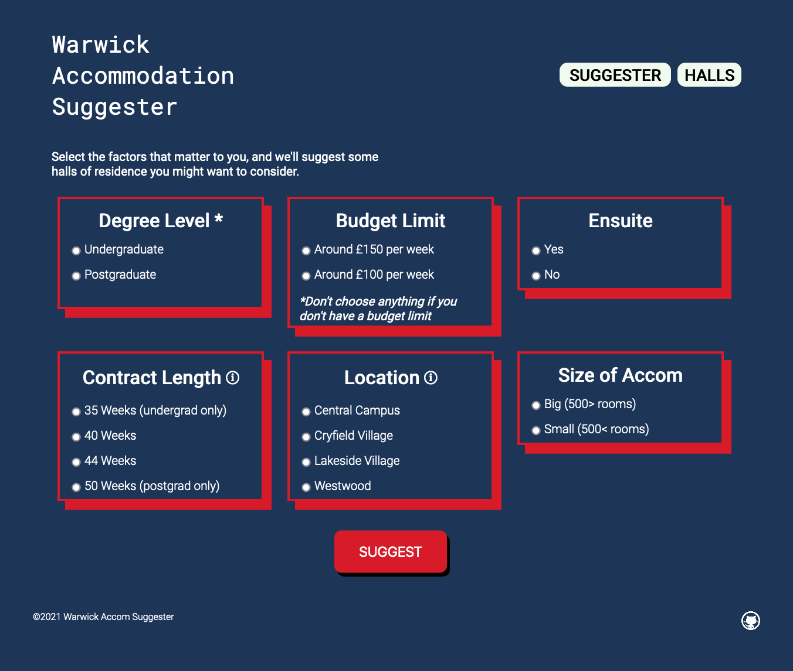

# Warwick Accommodation Suggester
### [You can visit the website here](ad.)

## Description

Find the accommodation that suits you the best with the Accommodation Suggester!

 Simply choose all the factors **that matter to you**, and be recommended a list of accommodations that match your criteria. This is a tool that I wish existed when I was choosing an accommodation in the Summer of 2020. Warwick's official website has a list of all the accommodations but does not let you filter based on specific attributes. 

 I decided to make this tool myself after finishing my first year studying Computer Science. It was fun to make and I hope you've found it useful.
 
 ## Suggestions

 If you discover any bugs, have any ideas on features I should add to the website, or just wanna chat you can message me on discord: B-Rabbid#7445

 ## Credits
 I've taken all the accommodation images and information from the official University of Warwick [website](https://warwick.ac.uk/services/accommodation/). If you click the images on the "Halls" page you will be directed to that accommodations page. All rights to the images and the information used belong to the University of Warwick. 

 
